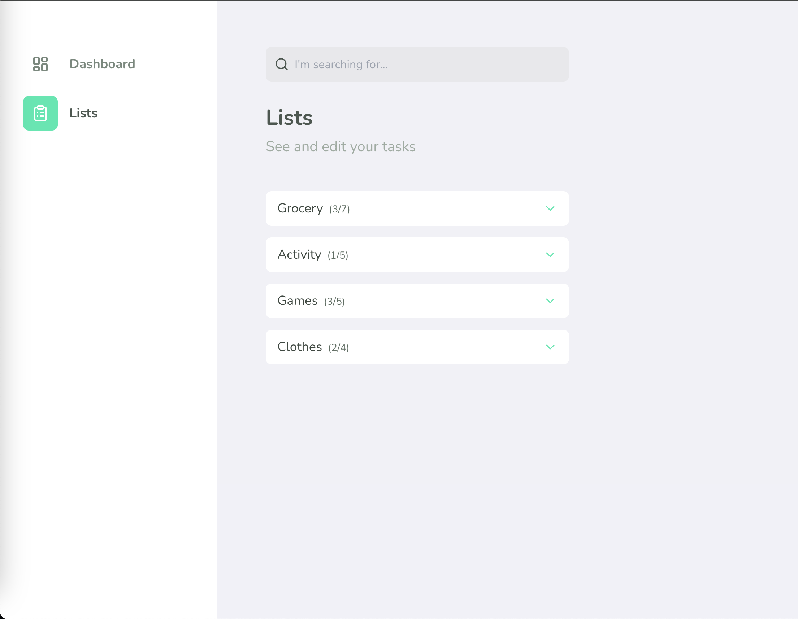

# **Task Tracker**


## **Description**

The **Task Tracker** is a personal productivity tool designed for individual users. It allows individuals to create customized lists for various purposes such as shopping, daily activities, or dietary items. Users can efficiently manage and organize their tasks, making it a versatile solution for personal organization and productivity.
<br/>

## **Screenshots**

<div>



</div>

## **Usage experience**

- Realtime
  
https://github.com/leandrodsi/monorepo/assets/38085899/99dfcc0c-0cb3-490d-9a8d-cff934ddd969

- Mobile
  
https://github.com/leandrodsi/monorepo/assets/38085899/07000a80-ca03-47da-99c3-c3797446d380


https://github.com/leandrodsi/monorepo/assets/38085899/7c1e351c-742d-40da-8c72-b37c8280b332


## **Prerequisites**

Set up the necessary environment for developing a React Native application using Expo. You can do this according to the official [documentation](https://reactnative.dev/docs/environment-setup?guide=quickstart).

## **Instalation**

```bash
# Clone the project
$ git clone https://github.com/leandrodsi/monorepo.git

# Access the folder
$ cd monorepo

# Install the dependencies
$ yarn

```

**Starting a project**

- Api

```bash
#Access the web folder
$ cd apps/api

# Web application
$ yarn start:dev
```

To execute the web application, you need to change the IP address located on `<root>/packages/api/src/api/index.tsx` to your local IP.

To execute the app em mobile applications successfully (with realtime), you need to change the IP address located on `<root>/apps/app/src/components/Container/index.tsx` to your local IP.

To execute the app e

- Web

```bash
#Access the web folder
$ cd apps/web

# Start application
$ yarn dev
```

- Mobile

  - Android

  ```bash
  #Access the app folder
  $ cd apps/app

  # Start application on Android
  $ yarn android
  ```

  - iOS

  ```bash
  #Access the app folder
  $ cd apps/app

  #Install pods
  $ cd ios && pod install && cd ..

  # Start application on Android
  $ yarn ios
  ```

### **SCOPE**:

The project aimed to address four specific functionalities:

1. ** _ReactJS_ and _Next.js_ Development**:

   - Design and implement a **ReactJS** component that benefits from **Next.js's** server-side rendering capabilities. This should focus on optimizing performance and enhancing SEO.
   - Address challenges related to data fetching in a server-side rendered environment and elaborate on any other considerations unique to **Next.js**.

2. ** _React Native_ and Data Synchronization**:

   - Develop a **React Native** feature that revolves around fetching and updating data dynamically. The goal is to ensure that users are consistently presented with the most recent and relevant data.
   - Highlight and address challenges such as handling changing network conditions, battery efficiency, and ensuring data integrity.

3. **Native Module Development in _React Native_ **:

   - Craft a native module for the **React Native** ecosystem. This could involve leveraging a device-specific feature, enhancing user experience, or optimizing a particular performance-heavy task.
   - Detail the process of facilitating seamless communication between the native module and React Native's JavaScript layer, ensuring data integrity and smooth user experience.

4. **Monorepo Management**:
   - Organize and manage your **ReactJS** and **React Native** solutions within a monorepo setup. Emphasize package sharing, efficient dependency management, and strategies for ensuring code reusability across platforms.
   - Provide insights into challenges faced and best practices for maintaining a monorepo setup for **React** projects.

An idea that emerged to address these four points was the **TaskTracker**, incorporating **Next.js** for web applications (addressing item 1), **React Native** for mobile (addressing items 2 and 3), and an API for information management—all within a monorepo, effectively covering all four items.

The layout was created using **Figma** and can be accessed **[here](https://www.figma.com/file/FFB4MxaSfMHamxt4aSnPc2/JobTest?type=design&node-id=0%3A1&mode=design&t=TbcfFo5R6tTbKieY-1)**.

<br/>
<hr/>
<br/>

### **MONOREPO**:

The monorepo was conceived for ease of implementation, scalability, and swift processing, employing the Turbo Repo tool with a pre-configured caching system. It introduces a standardized folder structure, distinguishing between 'Apps' (housing web, mobile, APIs) and 'Packages' for shared components. A well-thought-out architecture within a monorepo can significantly reduce duplicated code, enhancing productivity.

**Challenges**:
Included my inaugural implementation of a monorepo, with major hurdles lying in the preliminary study of structure and organization rather than the actual implementation.

<br />

### **WEB**:

The web project leveraged Next.js, offering support for SSR, SSG, basic routing, and more. The application comprises a Dashboard (SSR) showcasing the user's list information and task progress. The Tasks screen enables users to manage tasks. Updates occur via REST, lacking real-time synchronization.

**Challenges**:
Despite being well-acquainted with React, I hadn't worked with a Next.js version beyond 13, where there was a change in how SSR components are created. I found the new method of creating SSR components much easier, and, akin to the monorepo, the primary challenge lies in studying and analyzing the structuring of Client-Side and Server-Side components.

<br />

### **MOBILE**:

The mobile app, built in React Native using Expo with the Bare workflow, empowers users to create activity lists, add tasks, and update tasks. In contrast to the web, mobile updates use a socket, ensuring real-time reflection of changes made on the web.

**Challenges**:
Despite being my preferred technology, integrating Nativewind into the project for React Native posed challenges. Opting for Nativewind, which works well for web applications, might not have been the best choice for React Native, but that's what made it a challenge

<br />

### **NATIVE MODULES**:

Regarding native modules, one suggestion was to monitor the user's internet connection. A NetInfo module was created for both applications, with the Android module developed in Java and the iOS module in Swift. These modules export a listener to allow JS-side connection change monitoring.

**Challenges**:
In the Native Modules domain, the main hurdle revolved around discovering and understanding native APIs for implementation. The most significant challenge was analyzing the native APIs, studying them and subsequently integrating them into the application architecture.

<br />

### **API (Extra)**:

For the API, NestJs was chosen for its robust architecture and an organized, intuitive project pattern. Prisma (ORM) was used alongside sqlite for the database. The API includes basic CRUD functionalities for lists and tasks, with a gateway for users to connect and receive real-time updates when modifications occur.

**Challenges**:
Designing the gateway to notify users of updates presented challenges. Similar to the monorepo, understanding the structure and how to notify users of updates was more challenging than the implementation itself.

<br />

### **PACKAGES**:

The 'Packages' folder serves exclusively for package sharing, whether for configuration or implementation. The project exported eslint, tailwind, and typescript configuration packages, simplifying the setup of new projects to be added to the monorepo. Non-configuration modules include:

- api: exports services and DTOs used in applications.
- models: centralizes item typings.
- store: configures Zustand for state management.
- tokens: standardizes tokens used by the frontend (colors, fonts, spacing, etc.).
- utils: provides practical and generic functionalities for various applications.

**Challenges**:
Attempting to achieve the most with the least, respecting the peculiarities of each project, proved challenging. While initially attempting to use the same code for everything, I discovered the importance of respecting each project's specificities. Something suitable for Next.js might not necessarily work for React Native or NodeJs. However, the ease of creating various projects of the same type and reusing what was created previously in these projects makes the effort worthwhile.

<hr />

## **Contribution**

The project was developed for learning purposes only. If you want to contribute with any improvement (code or idea) or provide constructive criticism, feel free to use the [issues](https://github.com/leandrodsi/monorepo/issues) tab.

## **Contact**

📞 <a href="tel:+351933968325">+351 933 968 325</a> <br />
 ✉️ <a href="mailto:leandrodsystems@gmail.com">leandrodsystems@gmail.com</a>
